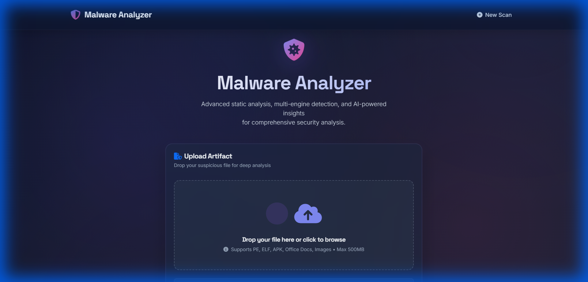
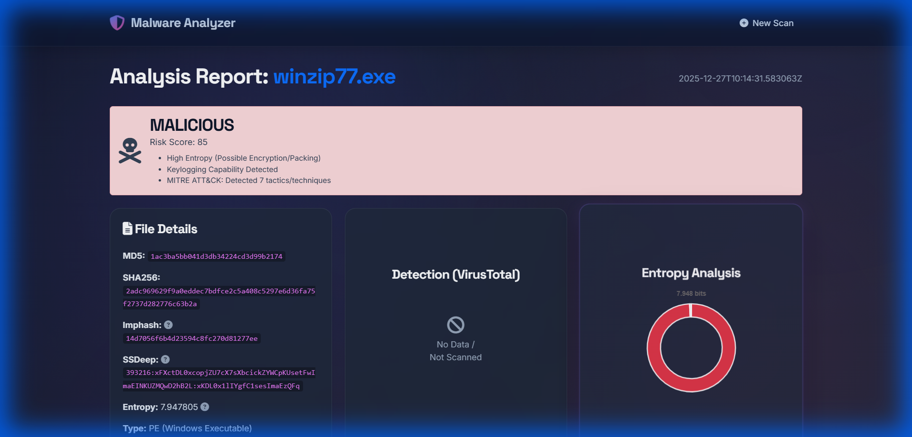
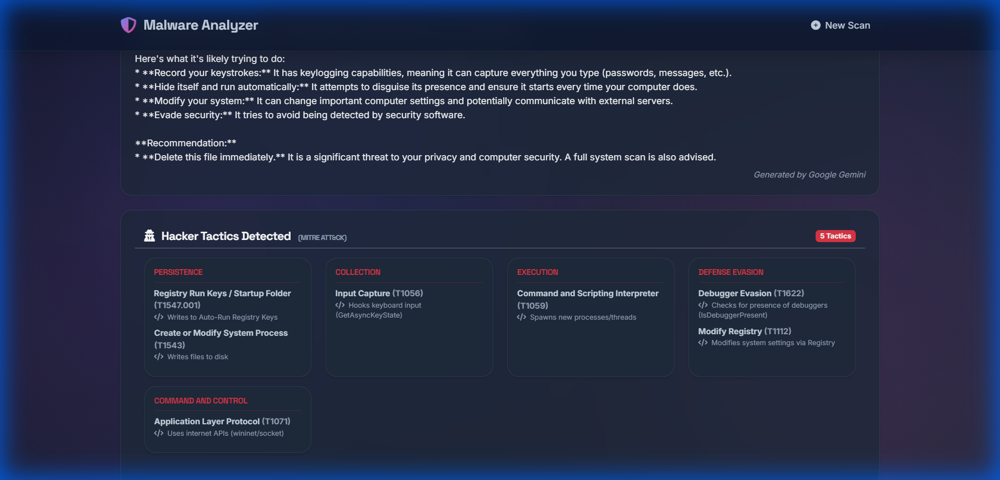
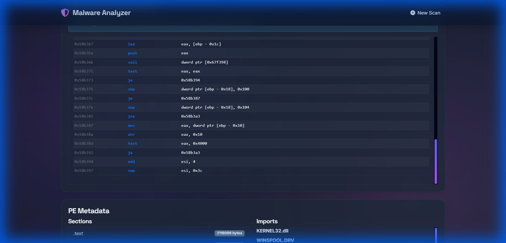
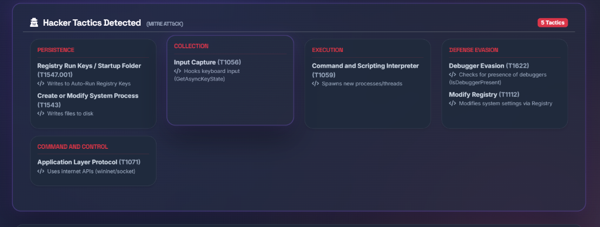
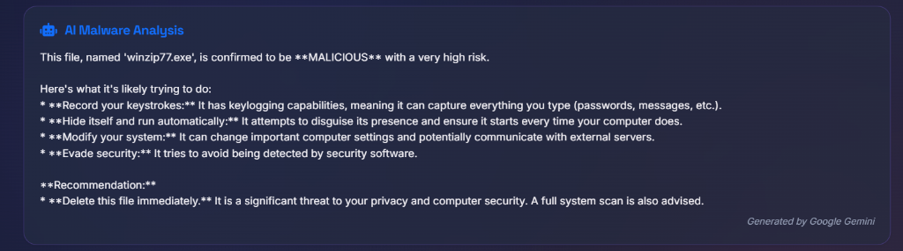

# 🛡️ Malware Analyzer - Advanced AI-Powered Static Analysis Platform


**Malware Analyzer** is an enterprise-grade, open-source static analysis framework designed for researchers, SOC analysts, and cybersecurity enthusiasts. It automates the dissection of suspicious binaries, extracting Critical Indicators of Compromise (IOCs) and leveraging **Generative AI (Google Gemini)** to produce human-readable threat reports.

> **🔍 Why this tool?**
> Analyzing malware manually requires distinct tools for Windows (`PEStudio`), Linux (`readelf`), and Android (`jadx`). **Malware Analyzer** unifies these into a single, automated pipeline with a modern web interface.

---

## 📸 Visual Tour

| **Command Center** | **Threat Intelligence** |
|:---:|:---:|
|  |  |
| *Centralized Dashboard for Analysis* | *High-Level Verdict & Risk Scoring* |

| **AI Detective** | **Code Inspection** |
|:---:|:---:|
|  |  |
| *Gemini AI Explaining Attack Vectors* | *Assembly Code & String Extraction* |

---

## 📚 Technical Deep Dive: Supported Formats

We don't just "read" files; we dissect their internal organs. Here is exactly what we analyze for each format:

### 1. 🪟 Windows Executables (PE - Portable Executable)
**Extensions:** `.exe`, `.dll`, `.sys`
*   **What it is:** The standard format for Windows programs. It contains code, data, and resources wrapped in specific "Headers".
*   **What we analyze:**
    *   **DOS Header & NT Header:** Checked for validity and machine type (x86 vs x64).
    *   **Timestamp:** Detects "TimeStomping" (when attackers fake the compilation date).
    *   **Imports (IAT):** We list every function the malware borrows from Windows.
        *   *Suspicious:* `WriteProcessMemory` (Injecting code), `SetWindowsHookEx` (Keylogging), `InternetOpen` (C2 Communication).
    *   **Sections:** we look for `.text` (code) and `.data` (variables). If a section is non-standard (e.g., named `.upx0`), it indicates **Packing**.

### 2. 🐧 Linux Binaries (ELF - Executable and Linkable Format)
**Extensions:** Binary files (no extension), `.so`
*   **What it is:** The standard binary format for Unix, Linux, and many IoT devices.
*   **Why it matters:** Most server-side malware and IoT Botnets (like **Mirai**) are ELFs.
*   **What we analyze:**
    *   **Program Headers:** Describes how the OS should create the process.
    *   **Section Headers:** Contains linking information.
    *   **Dynamic Tags:** Lists external libraries (`libc.so`, `libssl.so`). Malware often statically links libraries to avoid dependencies.

### 3. 📱 Android Applications (APK)
**Extensions:** `.apk`
*   **What it is:** A zip archive containing `classes.dex` (Dalvik Executable) code and an `AndroidManifest.xml` file.
*   **What we analyze:**
    *   **Permissions:** we scan `AndroidManifest.xml` for dangerous requests.
        *   *Critical:* `RECEIVE_SMS` (Stealing OTPS), `READ_CONTACTS`, `ACCESS_FINE_LOCATION`.
    *   **Secrets:** We scan for hardcoded API keys (AWS, Google Maps) often left by developers.

---

## 🧠 The Analysis Engine: How It Works

This application uses a multi-layered approach to determine if a file is malicious.

### Layer 1: Cryptographic Hashing
Before looking inside, we calculate the file's **Fingerprint**.
*   **MD5 & SHA256:** Unique strings representing the file content.
*   **ImpHash (Import Hash):** A hash calculated based on *only* the imported functions.
    *   *Significance:* If a hacker recompiles their malware with minor changes, the SHA256 changes, but the **ImpHash** often remains the same, allowing us to link it to the same threat actor.

### Layer 2: Entropy Calculation (Shannon Entropy)
*   **The Math:** $\sum P(x) \log_2 P(x)$
*   **The Logic:** Measures the randomness of data in the file on a scale of 0 to 8.
*   **The Verdict:**
    *   **0 - 5.5:** Normal Code (Structured).
    *   **6.0 - 6.8:** Suspicious (Possibly mild obfuscation).
    *   **7.0 - 8.0:** **CRITICAL**. The code is mathematically random. This means it is **Packed** (compressed) or **Encrypted**. Legitimate software rarely has entropy this high in its code section.

### Layer 3: YARA Signature Matching
*   **What it is:** A pattern-matching engine for malware researchers.
*   **How we use it:** We compile a database of regex-based rules.
    *   *Example:* If we see the byte sequence `E8 ?? ?? ?? ?? 8B 45 08` near text saying "WannaDecryptor", YARA flags it as **Ransomware**.

### Layer 4: AI & Machine Learning Integration
*   **Google Gemini (GenAI):** We construct a JSON prompt containing the *Entropy*, *Top Strings*, *Imports*, and *YARA matches*.
*   **The Prompt:** *"Act as a Level 3 Security Analyst. Analyze these technical artifacts and explain the attack chain."*
*   **The Output:** A natural language explanation of the threat, bridging the gap between raw data and human understanding.

---

## 🔍 Basic Concept: Step-by-Step Analysis Flow

For those new to malware analysis, here is exactly what happens when you click "Scan":

**1. The Upload**  
You upload a file (e.g., `suspicious_invoice.exe`). The server instantly saves it to a secure, isolated folder and renames it to a random ID to prevent it from accidentally running.

**2. The Identification**  
The tool looks at the file's "Magic Bytes" (the first few hex digits).
*   If it sees `4D 5A`, it knows it's a **Windows App**.
*   If it sees `7F 45 4C 46`, it knows it's a **Linux App**.
This ensures we don't try to read a PDF like it's a program.

**3. The Extraction**  
We pull out the "Metadata". Think of this like reading the nutrition label on a cereal box.
*   **Imports:** What ingredients does it use? (Does it use "Internet" functions? Does it use "Keyboard" functions?).
*   **Strings:** We dump all text. If we see "192.168.1.10" or "wallet.dat", that's a clue.

**4. The Verdict (Risk Scoring)**  
We calculate a score (0-100).
*   Is it packed? (+40 points)
*   Does YARA say it's ransomware? (+50 points)
*   Final Score: **90/100 (Malicious)**.

**5. The AI Expert Opinion (Google Gemini)**  
Finally, we send all these clues to **Google Gemini AI**. It acts as a virtual senior analyst, synthesizing the data to write a detailed report: *"This file appears to be a Keylogger. It hooks the keyboard API and tries to send captured keystrokes to an external IP address."*

---

## 📸 Feature Spotlight

| **MITRE ATT&CK Mapping** | **AI Threat Summary** |
|:---:|:---:|
|  |  |
| *Detects specific hacker techniques like 'Input Capture' or 'Defense Evasion'* | *Detailed explanation of capabilities generated by GenAI* |

---

## 🏗️ Architecture Diagram

```mermaid
graph TD
    User["User / Client"] -->|Uploads File| Web["Flask Web Server (app.py)"]
    Web -->|Checks Cache| DB[("Report Storage (JSON)")]
    
    subgraph "Core Analysis Engine (analyze.py)"
        Orchestrator["Analysis Orchestrator"]
        
        Orchestrator -->|Feature Extraction| Hashing["Hashing (SHA256/ImpHash)"]
        Orchestrator -->|Feature Extraction| Entropy["Shannon Entropy Calc"]
        Orchestrator -->|Feature Extraction| Strings["String Extraction"]
        
        Orchestrator -->|Dispatch| Type{"File Type?"}
        Type -->|PE/Windows| PE["PE Header Parser"]
        Type -->|ELF/Linux| ELF["ELF Segment Parser"]
        Type -->|APK/Android| APK["Manifest Analyzer"]
    end
    
    subgraph "Threat Intelligence"
        YARA["YARA Rule Engine"]
        VT["VirusTotal API v3"]
        GenAI["Google Gemini Flash"]
    end
    
    Orchestrator --> YARA
    Orchestrator --> VT
    Orchestrator --> GenAI
    
    PE & ELF & APK & YARA & VT & GenAI --> Report["Final Report Object"]
    Report -->|Save| DB
    Report -->|Render| UI["Web Interface (HTML/JS)"]